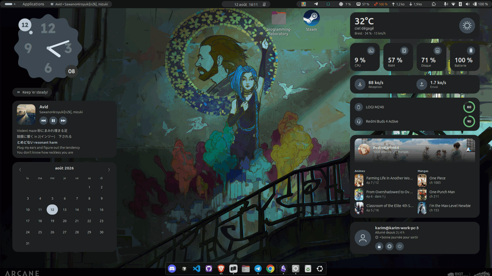
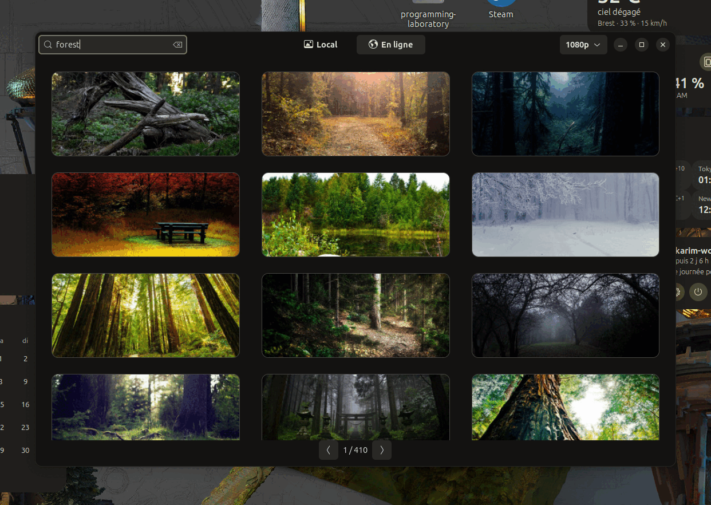
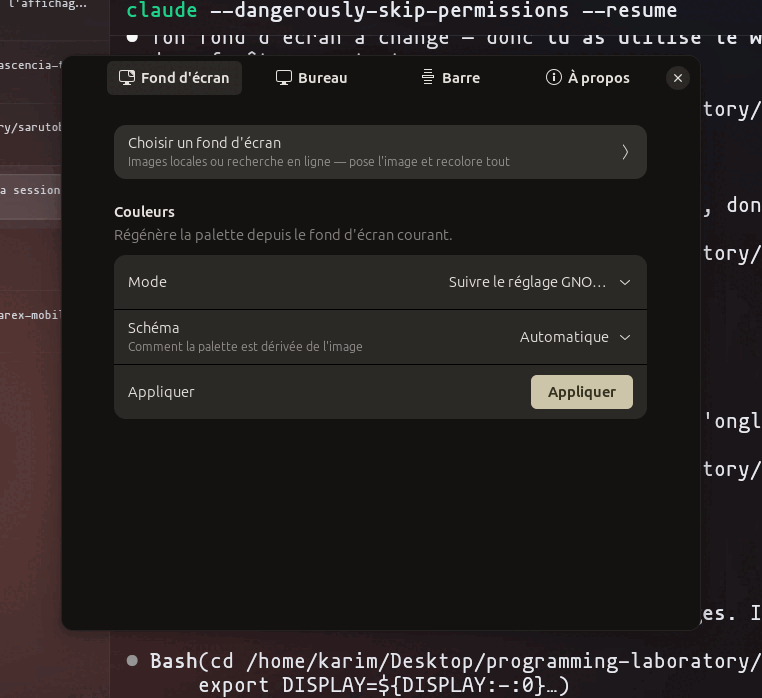
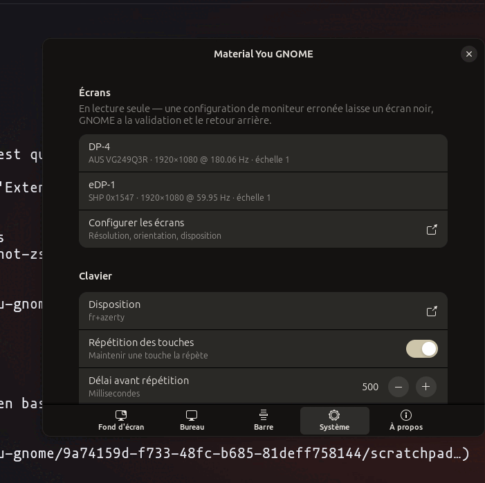
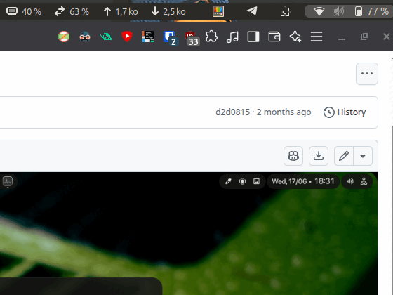
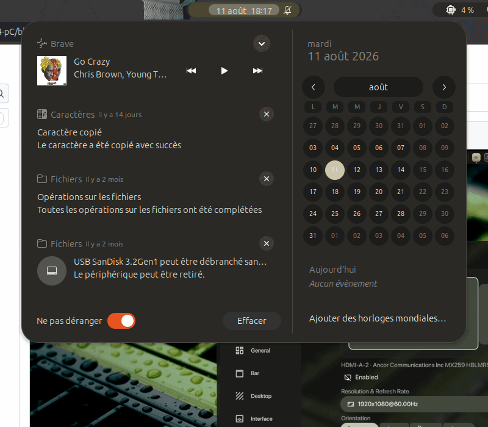

# material-you-gnome

Thématisation **Material You dynamique** pour GNOME : une commande pose un fond
d'écran, en extrait une palette, et recolore le Shell, GTK3/GTK4, les terminaux,
btop et VS Code. Puis une extension GNOME Shell rhabille la barre en îlots
Material 3 et pose une couche de widgets sur le bureau.

C'est le portage vers un stack **GNOME / Ubuntu** de l'esprit
d'[illogical-impulse](https://github.com/end-4/dots-hyprland) — sans Hyprland ni
Quickshell, qui n'y tournent pas.

Testé sur **Ubuntu 24.04, GNOME Shell 46, session X11**.

## Captures

Le bureau : horloge festonnée, citation, carte média avec paroles synchronisées,
calendrier, météo, ressources, horloges mondiales, carte utilisateur. Toutes les
couleurs viennent du fond d'écran.



| Sélecteur de fonds d'écran | Réglages |
|:---:|:---:|
|  |  |
| Grille locale et recherche en ligne | Cinq pages, tout s'applique à chaud |

| Page Système |
|:---:|
|  |
| Écrans, clavier, pointeur, fenêtres et démarrage, rassemblés |

| Quick settings | Calendrier et notifications |
|:---:|:---:|
|  |  |
| Surfaces natives de GNOME rhabillées en Material 3 | Même traitement, mêmes couleurs |

## Usage

```bash
wallset ~/Pictures/foo.jpg     # pose l'image et régénère toute la palette
wallset                        # régénère depuis le fond d'écran courant
wallset --random               # tire au sort dans ~/Pictures/Wallpapers
wallset --color '#8a4b2f'      # palette depuis une couleur, sans image
wallset --mode dark            # force le sombre (défaut : suit le réglage GNOME)
wallset --scheme scheme-vibrant  # change le schéma d'harmonisation
wallset --no-wallpaper         # recolore sans toucher au fond d'écran
```

Schémas disponibles : `auto` (défaut), `scheme-tonal-spot`, `scheme-content`,
`scheme-expressive`, `scheme-fidelity`, `scheme-fruit-salad`, `scheme-monochrome`,
`scheme-neutral`, `scheme-rainbow`, `scheme-vibrant`.

`auto` mesure le *colorfulness* de l'image ([métrique de Hasler &
Süsstrunk](https://infoscience.epfl.ch/record/33994), seuil 40) et retient
`scheme-neutral` sur les images ternes, `scheme-tonal-spot` sinon — un tirage
sur une capture d'écran ne produit donc pas une palette criarde. C'est le
portage de `scripts/colors/scheme_for_image.py` d'illogical-impulse, réécrit
avec PIL seul (l'original dépend d'OpenCV + numpy) : voir `bin/scheme-for-image`,
utilisable seul avec `--colorfulness` pour voir la valeur brute.

`--prefer` arbitre quand l'image contient plusieurs couleurs dominantes
candidates : `saturation` (défaut), `darkness`, `lightness`, `less-saturation`,
`value`, `closest-to-fallback`.

### Sélecteur de fonds d'écran : `wallpicker`

Port de `modules/ii/wallpaperSelector/` — grille locale, recherche en ligne,
filtre de résolution, pagination. Un clic pose l'image **et** régénère toute la
palette, puisqu'il délègue à `wallset` : le sélecteur ne connaît ni matugen ni
les hooks.

Lancé depuis le menu (« Fonds d'écran ») ou en ligne de commande.

**Application GTK4 séparée**, pas une surface du Shell : St n'offre ni grille
scrollable ni chargement d'image asynchrone, là où GTK4 donne `FlowBox`,
`ScrolledWindow` et `Gdk.Texture` sans effort.

**Fournisseur en ligne : wallhaven**, seul des trois utilisés par la référence à
fonctionner **sans compte** — Unsplash et Pexels lisent une clé d'API dans un
trousseau. Catégorie « general » et pureté « sfw » verrouillées. Seules les
vignettes sont téléchargées lors d'une recherche ; le fichier pleine résolution
n'est récupéré qu'au clic, et atterrit dans `~/Pictures/Wallpapers`.

### Polices

```bash
./bin/install-fonts
```

Installe dans `~/.local/share/fonts/material-you-gnome/` les polices de
l'identité visuelle illogical-impulse : **Material Symbols Rounded**,
**Space Grotesk**, **Readex Pro**, **JetBrains Mono Nerd Font**. Sans sudo, et
désinstallables par un `rm -rf` du dossier.

Elles ne sont **appliquées nulle part automatiquement** — c'est un prérequis pour
la suite, pas un changement de thème. Pour essayer Readex Pro comme police
d'interface :

```bash
gsettings set org.gnome.desktop.interface font-name 'Readex Pro 11'
gsettings reset org.gnome.desktop.interface font-name    # pour revenir
```

Google Sans Flex n'est pas installable : Google ne la redistribue pas via le
dépôt public Google Fonts. Le code amont ne l'utilise qu'à 3 endroits contre 12
pour Space Grotesk ; fontconfig substitue sans casse.

## Extension GNOME : material-you-gnome

`extension/material-you-gnome@karim/` — redécoupe le top bar en **îlots Material 3**
colorés par la même palette. Installée en lien symbolique par `install.sh` ;
`stylesheet.css` est généré par matugen, et `wallset` recycle l'extension pour
que GNOME relise les couleurs (le Shell ne lit la feuille d'une extension qu'à
son activation).

Ce qu'elle fait :

- **Îlots** — les trois zones du panel (`_leftBox` / `_centerBox` / `_rightBox`)
  reçoivent une classe CSS et deviennent des pilules encastrées. Aucun
  reparentage : le `Panel` de GNOME alloue ses boîtes lui-même dans
  `vfunc_allocate`, les déplacer casserait sa mise en page. `disable()` remet
  tout en état.
- **Workspaces** — l'indicateur natif de GNOME 46 (`#panelActivities`,
  `.workspace-dot`) est recoloré, pas remplacé. Une v1 en ajoutait un second :
  il doublait celui du Shell à l'écran.
- **Média** — indicateur MPRIS (titre • artiste, clic = play/pause, molette =
  piste précédente/suivante), masqué tant qu'aucun lecteur n'est sur le bus.
  La découverte D-Bus vit dans `lib/mpris.js`, partagée avec la carte bureau :
  un seul abonnement `NameOwnerChanged` et un seul proxy pour les deux surfaces.

Deux détails d'API GNOME 46, vérifiés dans `/usr/share/gnome-shell/St-14.gir` :

- `St.BoxLayout` **n'a aucun signal propre**. Les `actor-added` / `actor-removed`
  des tutoriels n'existent pas ; on utilise `notify::first-child`
  (`Clutter.Actor`) pour détecter une zone vide.
- Une zone vide est un cas réel : une extension qui déplace l'horloge hors du
  centre laisse `_centerBox` sans enfant, d'où une pilule fantôme si on ne la
  masque pas.

Chaque brique est isolée en `try/catch` dans `enable()` : après une mise à jour
de GNOME, une brique cassée n'empêche pas les autres de tourner, et l'erreur
part au journal au lieu de laisser l'extension à moitié appliquée.

### Widgets bureau

`lib/desktop.js` pose un conteneur dans `global.window_group`, **juste au-dessus
du background group** : les widgets sont sur le fond d'écran, sous les fenêtres.
Ils ne sont pas ajoutés *dans* le background group, car GNOME y appelle
`destroy_all_children()` quand il reconstruit les fonds — ils disparaîtraient à
chaque `wallset`.

Deux pièges d'empilement, tous deux silencieux :

- `set_child_above_sibling()` avec un « sibling » qui n'est pas un enfant du
  conteneur **n'émet qu'un avertissement Clutter, pas d'exception**. L'appel
  échoue sans bruit et la couche reste là où `add_child()` l'avait mise : au
  sommet, donc par-dessus toutes les fenêtres. D'où la vérification explicite du
  parent dans `_lower()`.
- **Mutter réordonne `window_group` à chaque réempilement** et fait remonter au
  sommet tout acteur qui n'est pas une fenêtre. Placer la couche une seule fois à
  l'activation ne suffit donc pas : elle repasse au-dessus dès le premier
  changement de focus. `_lower()` est rebranché sur `Meta.Display::restacked`.

C'est la **couche** qui place les widgets, pas les widgets eux-mêmes : chacun
déclare seulement une ancre (`top-left` / `top-right`) et ceux qui la partagent
s'empilent. Le placement se calcule sur les tailles *préférées*
(`get_preferred_width/height`), pas sur `width`/`height` — un widget qui lit sa
propre largeur au moment du placement obtient 0, Clutter n'ayant pas encore
alloué.

| Widget | Fichier | Source des données |
|---|---|---|
| Horloge festonnée | `widgets/clock.js` | Cairo, heure locale |
| Horloge numérique | `widgets/digitalclock.js` | heure locale (variante exclusive) |
| Bulle de citation | `widgets/quote.js` | clé GSettings `quote-text` |
| Horloges mondiales | `widgets/worldclocks.js` | `GLib.TimeZone`, clé `world-clocks` |
| Carte média | `widgets/media.js` | MPRIS via `lib/mpris.js` |
| Calendrier | `widgets/calendar.js` | horloge système |
| Météo | `widgets/weather.js` | Open-Meteo (sans clé) |
| CPU / RAM / Disque | `widgets/resources.js` | `/proc/stat`, `/proc/meminfo`, GIO |
| Carte utilisateur | `widgets/usercard.js` | `/proc/uptime`, D-Bus |

Un widget masqué ne réserve pas de place : la carte média disparaît quand aucun
lecteur ne tourne, et la pile se resserre (`notify::visible` déclenche un
replacement).

Les cartes d'une même colonne partagent une largeur explicite : sans ça leurs
bords droits partent en escalier (424 px contre 316 px avant unification), alors
que leurs bords gauches sont alignés par la pile.

Le placement se rejoue sur `notify::width` / `notify::height`, coalescé en idle.
Sans ça, **un widget dimensionné en CSS est placé d'après une taille préférée
provisoire** : le nœud de thème n'est résolu qu'après `enable()`, donc la ligne
des ressources se retrouvait 54 px trop large et son bord droit tombait à 21 px
du bord d'écran au lieu de 48. La taille allouée fait foi dès qu'elle existe,
avec repli sur la taille préférée au tout premier passage.

**La carte utilisateur** passe par D-Bus (`org.gnome.ScreenSaver.Lock`,
`org.gnome.SessionManager.Shutdown`) plutôt que par les API internes du Shell
(`Main.screenShield`…) : ces interfaces sont publiques et stables, les internes
changent à chaque version de GNOME. `Shutdown()` ouvre la confirmation de GNOME,
il n'éteint pas sèchement.

**Pochette arrondie** : `St.Icon` ne découpe pas son contenu selon
`border-radius`, contrairement à une `background-image`, que St clippe bien. La
pochette est donc un `St.Widget` dont on pose le fond en style inline, avec
`background-size: cover` pour recadrer sans déformer. St ne sachant pas charger
une URL distante, les pochettes `https://` sont rapatriées dans
`~/.cache/material-you-gnome/`, sous un nom dérivé de l'URL — les propriétés
MPRIS changent plusieurs fois par piste, il ne faut pas retélécharger à chaque
fois.

**L'horloge** reprend `widgets/clock/CookieClock.qml`. Dessinée en Cairo dans une
`St.DrawingArea`, seul moyen d'obtenir une forme non rectangulaire sous St.

Trois partis pris viennent de la capture de référence, pas d'une supposition :

- **Les chiffres sont un filigrane**, pas du texte de premier plan (alpha 0.28).
  C'est la variante `BigHourNumbers` de leur `MinuteMarks` — d'où l'absence
  totale de graduations sur le cadran : les gros chiffres *sont* les marques.
- **La trotteuse est un point qui orbite**, sans tige jusqu'au centre.
- **Deux ronds opposés** à cheval sur le bord : le jour en haut à gauche, à
  l'accent ; le mois en bas à droite, volontairement plus sourd.

L'ombre portée est **trois remplissages décalés** de la même silhouette, pas un
flou gaussien : la trotteuse impose un repaint par seconde, et un vrai flou
serait recalculé à chaque fois.

**La citation** se règle en écrivant dans le fichier ; la bulle disparaît s'il
est vide ou absent, et un `Gio.FileMonitor` reprend les changements à chaud,
sans recharger le Shell :

```bash
echo "Keep 'er steady!" > ~/.config/material-you-gnome/quote.txt
```

Son icône est le glyphe **U+E244** de Material Symbols Rounded, relevé dans la
cmap de la police plutôt qu'écrit en ligature `format_quote` : la police a bien
une table GSUB, mais un codepoint absent donne un glyphe manquant, là où une
ligature non résolue afficherait le mot en toutes lettres. Ses
couleurs ne sont pas codées en JS : elles sont lues sur le nœud de thème via des
propriétés CSS maison (`-myg-clock-face`, `-myg-clock-ink`, …), que
`St.ThemeNode.lookup_color` accepte telles quelles. La palette reste donc définie
au seul endroit qui la connaît, le template matugen. Les autres cartes sont des
rectangles arrondis, donc du St ordinaire stylé en CSS.

**Les ressources** lisent `/proc` et GIO directement — lancer `top`, `free` ou
`df` toutes les 5 secondes serait trois processus par tick. La mémoire utilise
`MemAvailable` (et non `MemFree`), qui compte le cache réclamable comme
disponible ; le disque n'est relu qu'une fois par minute.

**Services partagés.** Les collectes vivent hors des widgets : `lib/mpris.js`
(barre + carte média), `lib/weather-service.js` (carte météo + phrase d'ambiance
de la carte utilisateur) et `lib/lyrics-service.js`. Un seul abonnement D-Bus,
une seule requête par source. Les widgets se contentent de se débrancher ; la
destruction appartient à `extension.js`, une fois tous les consommateurs retirés.

**Paroles synchronisées** : source [lrclib.net](https://lrclib.net) — API
publique, sans clé — comme le `scripts/lyrics/lyrics.py` d'illogical-impulse.
`/api/get` d'abord (titre + artiste + durée), `/api/search` en repli, car les
lecteurs web annoncent souvent « Titre - Artiste » dans le titre et rien
d'exploitable en artiste.

Trois détails qui comptent :

- **MPRIS n'émet pas de `PropertiesChanged` pour `Position`.** La seule façon de
  suivre l'avancement est de la sonder — une fois par seconde, et seulement
  pendant la lecture.
- **Le cache stocke aussi les échecs**, sous un marqueur `#none`. Sans lui, une
  vidéo sans paroles relancerait deux requêtes à chaque notification MPRIS, et
  elles arrivent en rafale.
- **Les entrées LRC sans texte sont filtrées** : les fichiers horodatent les
  silences, et les garder faisait disparaître la surbrillance à chaque pause.

**La météo** demande un lieu :

```bash
./bin/set-weather Nantes             # résout la ville en coordonnées
./bin/set-weather --coords 47.21 -1.55 "Nantes"
./bin/set-weather --show
```

Écrit `~/.config/material-you-gnome/weather.conf`. Tant que ce fichier n'existe
pas, **le widget n'émet aucune requête réseau** et affiche simplement la commande
à lancer : déduire la position depuis l'IP exposerait l'utilisateur à un service
tiers sans qu'il l'ait demandé. Le géocodage et les relevés passent par
Open-Meteo — pas de clé d'API, pas de compte.

### Réglages

`gnome-extensions prefs material-you-gnome@karim`, ou le bouton Réglages dans
Extensions. Quatre pages, équivalent GNOME de `modules/ii/settings/` (dont la
moitié des pages — `HyprlandConfig`, `NiriConfig` — n'a pas de sens ici) :

- **Fond d'écran** — ouvre `wallpicker`, et pilote le mode clair/sombre et le
  schéma de dérivation. Rien n'y est stocké : chaque contrôle lance `wallset`,
  qui reste la seule autorité sur la palette. Les dupliquer en GSettings créerait
  un état parallèle capable de diverger de ce qui est réellement appliqué.
- **Bureau** — chaque widget se coupe indépendamment, style d'horloge
  (festonnée ou numérique), fuseaux des horloges mondiales, texte de la
  citation, paroles synchronisées, marge aux bords.
- **Barre** — bascule « barre flottante » (fond transparent, ne laissant que les
  îlots).
- **Système** — équivalent de leur page `HyprlandConfig`, qui existe parce que
  Hyprland n'a aucune application de réglages. GNOME en a une : cette page ne
  réinvente donc rien, elle rassemble au même endroit ce qui est réparti dans
  cet onglet chez eux — écrans, clavier, pointeur, activation des fenêtres,
  animations, applications au démarrage.

  Deux sections de leur page **n'ont pas d'équivalent** : gaps, bordures,
  opacité et flou d'une part, layout dwindle/master d'autre part — ce sont des
  notions de compositeur pavant, que Mutter n'expose pas.

  Les **écrans restent en lecture seule**. Mutter sait les reconfigurer via
  `ApplyMonitorsConfig`, mais une configuration erronée laisse un écran noir :
  on affiche l'état et on ouvre le panneau de GNOME, qui a la validation et le
  retour arrière temporisé.
- **À propos**.

Tout passe par GSettings et s'applique **à chaud** : couper un widget le détruit
et la pile se resserre, sans recharger le Shell. La citation, qui vivait dans
`~/.config/material-you-gnome/quote.txt`, est désormais dans la clé `quote-text`
— une seule source de vérité, éditable depuis le panneau.

Le fond transparent de la barre est posé en **style inline** plutôt que dans la
feuille générée : celle-ci est produite par matugen, on ne peut pas la réécrire à
chaud. Revenir à `null` rend la main au CSS.

Le lieu de la météo reste en ligne de commande (`bin/set-weather`), parce qu'il
demande un géocodage que le panneau n'a pas.

### Itérer sur l'extension : `./bin/reload-shell`

**`gnome-extensions disable && enable` ne recharge pas le JavaScript.** GJS met
les modules ES en cache depuis GNOME 45 : recycler l'extension rejoue les
classes déjà en mémoire, et seul `stylesheet.css` est relu. Toute modification
d'un `.js` exige un redémarrage du Shell.

`bin/reload-shell` s'en charge, en pilotant `Alt+F2` → `r`.

**Ne pas utiliser `gnome-shell --replace`.** Sur une session Ubuntu, le Shell est
géré par systemd (`org.gnome.Shell@x11.service`, dans `session.slice`). Une
instance lancée à la main fait mourir le process principal de l'unité, systemd
relance l'unité, et la nouvelle instance écrase la manuelle : ça ressemble à un
crash de session. `Alt+F2` → `r` demande au contraire au Shell **en cours** de se
relancer sur place (`Meta.restart`) — l'unité systemd et les fenêtres ne bougent
pas, le PID non plus.

Le script remet aussi `disable-user-extensions` à `false` si un chemin de
redémarrage l'a coupé : ce réglage désactive `user-theme`, donc le thème
MaterialYou avec.

X11 seulement — sous Wayland le Shell ne peut pas se relancer sur place.

### Rendu flottant

Le panel garde un fond opaque par défaut. Pour le rendu flottant
d'illogical-impulse, passer `#panel.myg-panel { background-color: … }` à
`transparent` dans `templates/extension-stylesheet.css` — au prix du contenu des
fenêtres maximisées qui transparaît sous la barre.

## Ce qui est recoloré

| Cible | Mécanisme | Couverture |
|---|---|---|
| GNOME Shell (top bar, menus, calendrier, OSD, Alt+Tab, dash) | thème dérivé de Yaru + overrides | bonne |
| GTK4 / libadwaita | `@define-color` dans `~/.config/gtk-4.0/gtk.css` | ~100 % |
| GTK3 | `@define-color` dans `~/.config/gtk-3.0/gtk.css` | **~70 %** — voir Limites |
| Ghostty | fichier inclus via `config-file` | complète |
| GNOME Terminal | `gsettings` sur le profil par défaut | complète |
| btop | thème `material-you.theme` | complète |
| VS Code | `workbench.colorCustomizations` mergé via `jq` | complète |

## Architecture

matugen génère **un fichier canonique** de variables shell
(`~/.cache/material-you-gnome/colors.sh`) que les hooks consomment. Les cibles
simples passent par un template matugen direct ; les cibles complexes (thème
Shell, merge JSON, dconf) passent par un hook.

```
wallset
  ├─ gsettings          pose le fond d'écran (picture-uri + picture-uri-dark)
  ├─ matugen            templates/ → colors.sh, gtk3, gtk4, ghostty, btop
  └─ hooks/
       ├─ build-shell-theme.sh     copie Yaru + append overrides Material You
       ├─ apply-gnome-terminal.sh  dconf (GNOME Terminal ne lit aucun fichier)
       └─ apply-vscode.sh          merge jq, sans écraser les réglages perso
```

### Pourquoi copier Yaru plutôt que le patcher

Yaru compile son SCSS : `gnome-shell.css` fait ~5000 lignes de hex en dur, sans
une seule variable. Impossible d'y injecter des couleurs par substitution. Le
hook copie donc le thème complet — **assets SVG inclus, sinon les icônes du
Shell cassent** — et append un bloc d'overrides en fin de fichier. La cascade CSS
fait le reste, et la copie est régénérée à chaque `wallset`, donc les mises à
jour de Yaru sont reprises automatiquement.

À noter : St, le moteur CSS du Shell, ne supporte pas `var()`. Tous les hex sont
donc inlinés dans le bloc généré.

### Les trois blocs d'overrides

Le hook append trois blocs distincts, dans cet ordre :

1. **Couleurs** — fonds et textes des conteneurs (panel, menus, quick settings,
   notifications, calendrier, overview, dash, dialogues, OSD, Alt+Tab).
2. **Géométrie Material 3** — l'échelle de formes M3 : 12 px pour les entrées de
   menu, 16 px pour les icônes d'apps, 20 px pour les notifications, 28 px pour
   les conteneurs de premier niveau, pilule pour les boutons et les tuiles de
   quick settings. **C'est ce bloc qui fait le gros de l'effet** : recolorer sans
   toucher aux formes donne « Yaru en d'autres couleurs », pas Material 3.
3. **Accent de marque Yaru** — Yaru pose son orange `#d34615` (et `#ef8661` pour
   les anneaux de focus) sur une quarantaine de sélecteurs que le bloc « couleurs »
   ne couvre pas : chevron des quick settings, jour courant du calendrier, boutons
   par défaut, point d'application ouverte du dash, aperçu de tuilage. Sans ce
   bloc, l'orange Yaru ressort partout où l'on interagit.

La liste du bloc 3 vient d'une extraction de **tous** les blocs du CSS Yaru
contenant ces deux teintes, pas d'un repérage à l'œil. Répartition trouvée :
30 `box-shadow` (anneaux de focus, posés avec `!important` — il faut donc la même
arme pour reprendre la main), 15 `background-color`, 7 bordures. Les champs de
saisie ne prennent l'accent que **sur le focus**, jamais en fond : leur poser un
fond coloré serait une faute.

### Rechargement du Shell sans redémarrage

Sur X11, relancer `gnome-shell` casse la session. Le script bascule à la place le
réglage `user-theme` sur `''` puis le remet sur `MaterialYou` : le Shell relit sa
feuille de style, sans redémarrage ni fenêtres perdues.

## Limites connues

- **GTK3 ~70 %.** Yaru code en dur beaucoup de couleurs dans son CSS compilé, hors
  de portée des `@define-color`. Les apps GTK4/libadwaita sont, elles, recolorées
  intégralement.
- **Les apps déjà ouvertes doivent être relancées.** GTK ne relit pas
  `gtk.css` à chaud. Le Shell et les terminaux, si.
- **Le thème d'icônes n'est pas recoloré** (Yaru reste tel quel). Ça demanderait
  de regénérer les SVG, hors périmètre.

## Fichiers modifiés hors du projet

Tous sauvegardés en `.before-material-you` au premier passage :

- `~/.config/ghostty/config` — une ligne `config-file = matugen-colors` ajoutée
  **en tête**, donc tes réglages manuels plus bas gardent la priorité. Si tu veux
  que les couleurs générées gagnent, retire tes lignes `palette = 4/12` et
  `selection-*` de ce fichier.
- `~/.config/btop/btop.conf` — `color_theme`
- `~/.config/Code/User/settings.json` — seule la clé `workbench.colorCustomizations`
  est touchée

Écrits intégralement (aucun contenu préexistant) : `~/.config/gtk-3.0/gtk.css`,
`~/.config/gtk-4.0/gtk.css`, `~/.local/share/themes/MaterialYou/`.

## Désinstallation

```bash
gnome-extensions disable material-you-gnome@karim
rm -f ~/.local/share/gnome-shell/extensions/material-you-gnome@karim
rm -rf ~/.local/share/themes/MaterialYou ~/.cache/material-you-gnome
rm -rf ~/.local/share/fonts/material-you-gnome && fc-cache -f
rm -f ~/.config/gtk-3.0/gtk.css ~/.config/gtk-4.0/gtk.css ~/.local/bin/wallset
gsettings set org.gnome.shell.extensions.user-theme name ''
for f in ~/.config/ghostty/config ~/.config/btop/btop.conf ~/.config/Code/User/settings.json; do
  [ -f "$f.before-material-you" ] && mv "$f.before-material-you" "$f"
done
```

## Dépendances

`matugen` (≥ 4.0, `cargo install matugen`), `jq`, `gsettings`, l'extension GNOME
`user-theme`, et `python3` + `python3-pil` pour `--scheme auto`.

## Références

`.references/end4-pC/` (non versionné) contient le clone de
[`pctrade/end4-pC`](https://github.com/pctrade/end4-pC), fork d'illogical-impulse.
Le code est en QML/Quickshell, **non exécutable sur GNOME** — il sert de
référence de design et d'algorithmes. `.references/MAP.md` en donne la carte :
quels fichiers correspondent à quoi ici, et où regarder pour la suite.

Récupérable avec :

```bash
git clone https://github.com/pctrade/end4-pC .references/end4-pC
```
